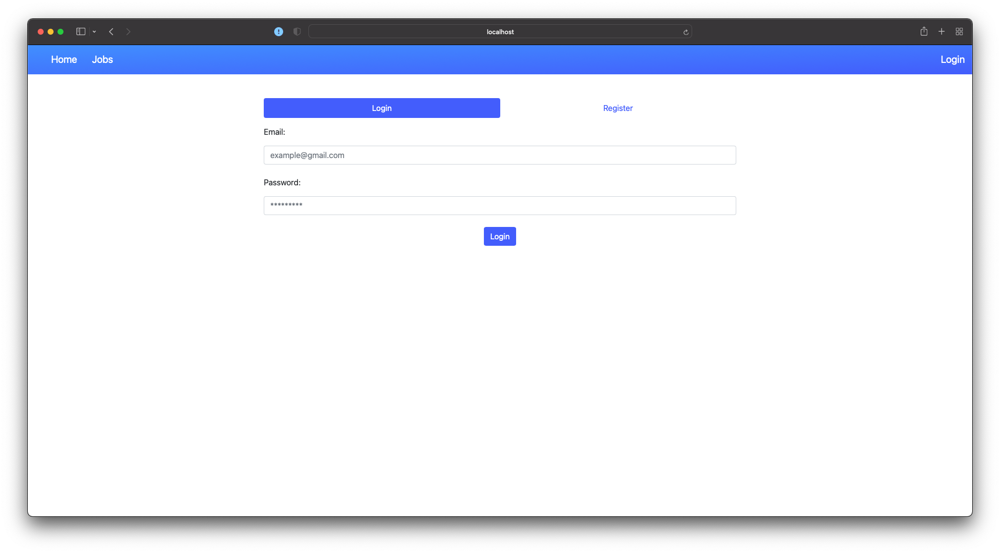
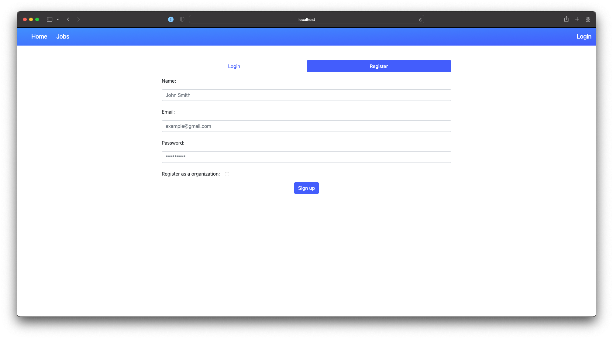
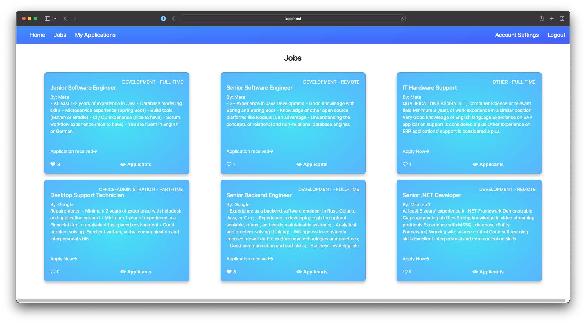
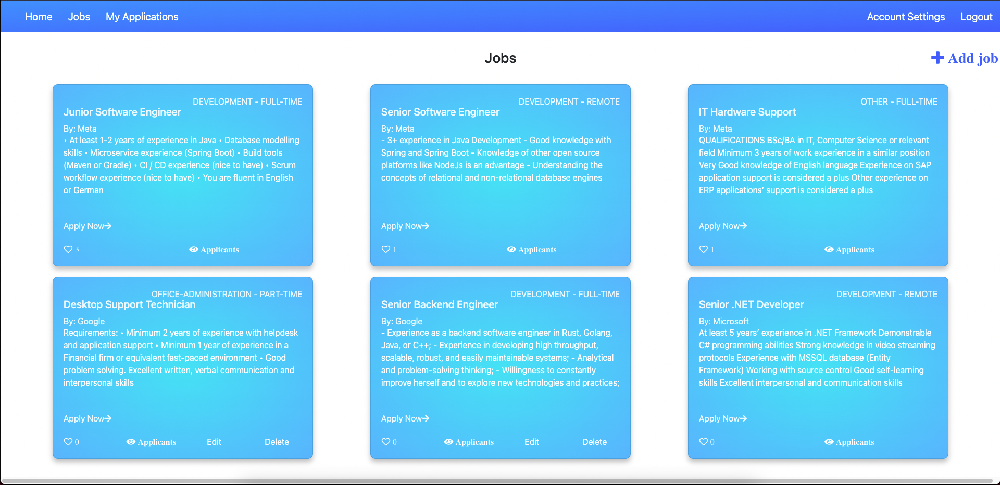
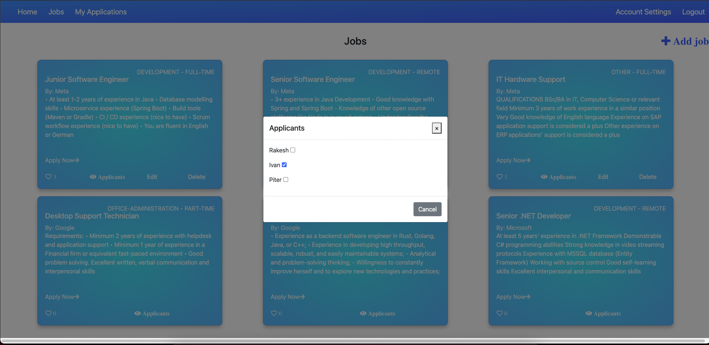
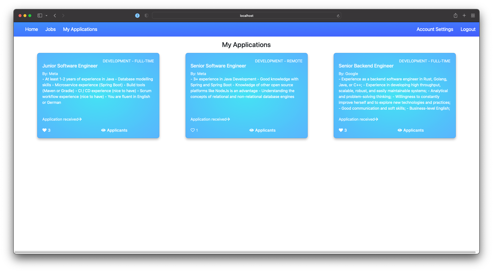
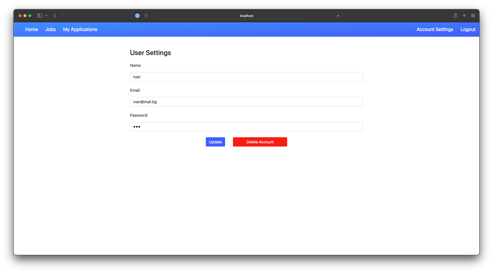
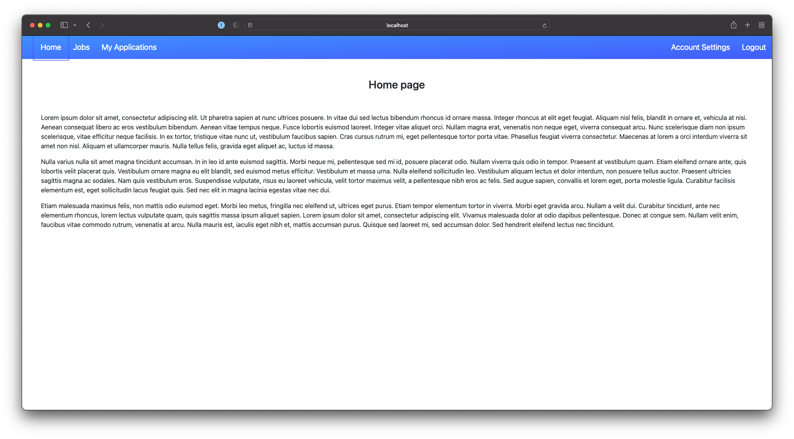

# Singlepage-with-Angular

## 1. cd job-project/

## 2. "npm install"

## 3. Run "npm start" to run  the web application AND the json server

### This project is released to the course of singlepage web application with Angular

# Screens

## Login:

## Register:

## Jobs (from the user perspective):

## Jobs (from the organization perspective):

## Create/Edit Job (from the organization perspective):

## Approve person for job

## My Applications:

## User Settings:

## Home Page:

